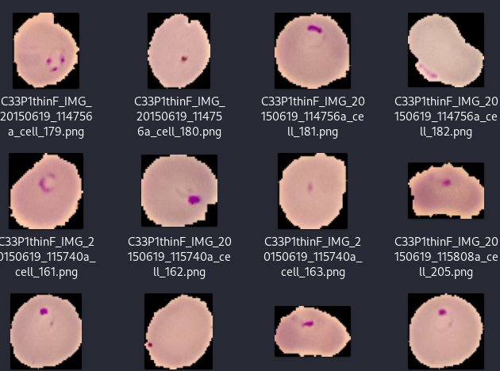

# Malaria Detection Using Convolutional Neural Networks (CNN)

## Introduction:
This repository contains code for detecting malaria using Convolutional Neural Networks (CNN). Malaria is a life-threatening disease caused by parasites that are transmitted to people through the bites of infected female Anopheles mosquitoes. Early detection of malaria is crucial for timely treatment and prevention of its spread.

## Dataset:
The dataset used for this project is the Malaria Cell Images Dataset, which can be found [https://www.kaggle.com/datasets/iarunava/cell-images-for-detecting-malaria/data]. This dataset contains a large number of cell images with two classes: infected and uninfected. Each image is labeled accordingly, making it suitable for training machine learning models for malaria detection.

## Requirements:
To run the code in this repository, you will need the following dependencies:
- Python (>=3.6)
- TensorFlow (>=2.0)
- Keras (>=2.0)
- NumPy
- Matplotlib
- OpenCV

